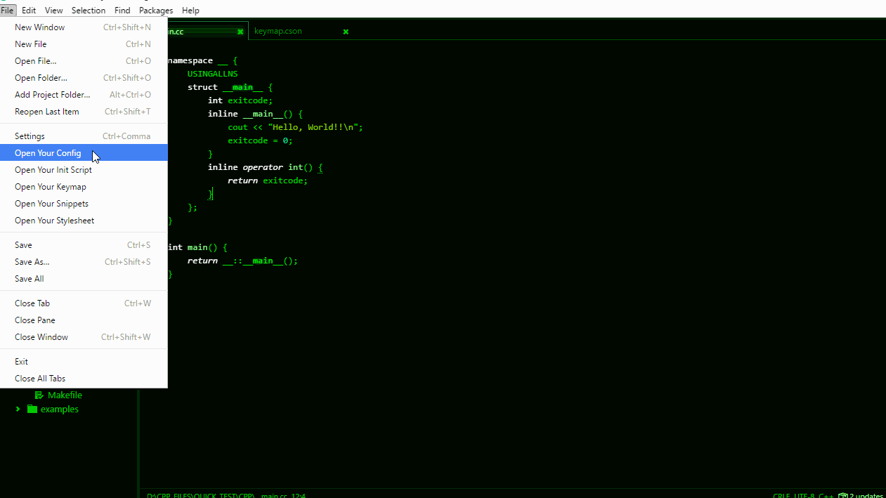
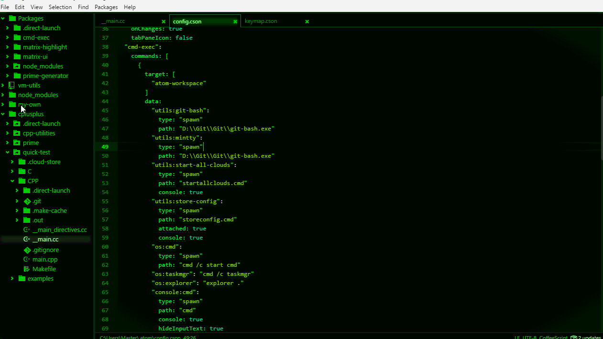
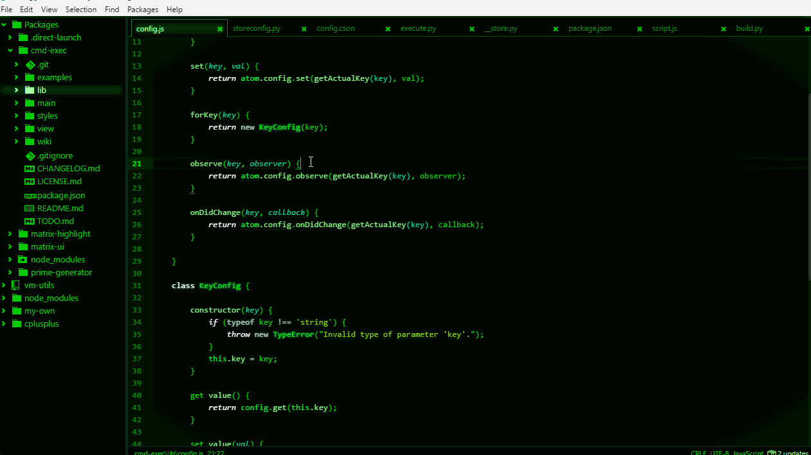
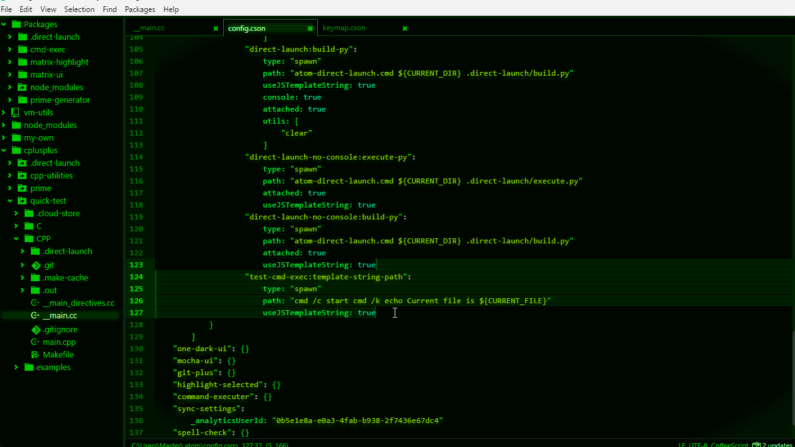
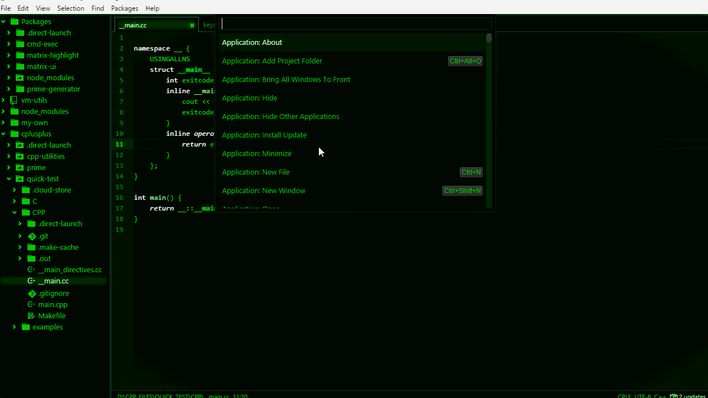

# Previews

Before you see them (below), please take a look at my example [config.cson](./config.cson) before ask me how to do it :smile:

## Open Windows File Explorer
Open folder containing 'current' file

## Open MinTTY
Open MinTTY with working directory contains that file

## A Console which built by HTML
Honestly, they're HTML elements but I written it by XML + JavaScript

## How to use template string for path
See also: [Template strings - JavaScript | MDN](https://developer.mozilla.org/en-US/docs/Web/JavaScript/Reference/template_strings)

## Bonus: Compile C++ file, yay ;-)
Atom command: `gnu-compile:c-plus-plus` and `run:c-plus-plus`
Shell command: `g++ -std=c++14 -o ./main.exe ./main.cpp`

## Tips: Keybinding - You may already know :relaxed:
If you ask me what are `direct-launch:build-py` and `direct-launch-no-console:execute-py`, that's my own commands, I created them for my own needs :sunglasses:

